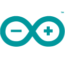

## Hi there, I'm Taeeun

### I'm an iOS Developer

- Swift
- SwiftUI
- UIKit
- Combine
- CoreData
- Firebase

### Connect with me

[][portfolio]
[][stackoverflow]
[][linkedin]
[][medium]

 
 

### Languages and Tools

 
 

### Latest Blog Posts

- [Review: iPhone app development — Monthly Wallet](https://taeeun-kim.medium.com/review-iphone-app-development-monthly-wallet-7f34d9f524ef)
- [How to create 3D models with Object Capture](https://taeeun-kim.medium.com/how-to-create-3d-models-with-object-capture-9b3d1226bd10)
- [The future of the Web Application with Windows 11](https://taeeun-kim.medium.com/the-future-of-the-web-application-with-windows-11-8ab88a2d16be)

### Launched App

- ### Monthly Wallet

  Keep track of your monthly recurring expenses with this beautifully designed minimalistic app

  [][monthlywallet]

[portfolio]: https://taeeun-kim.github.io/Portfolio/
[stackoverflow]: https://stackoverflow.com/users/15603993/taeeun-kim
[linkedin]: https://www.linkedin.com/in/taeeun-kim-a468b0219/
[medium]: https://taeeun-kim.medium.com
[monthlywallet]: https://apps.apple.com/app/monthly-wallet/id1580920572

<!-- https://fontawesome.com/license -->
